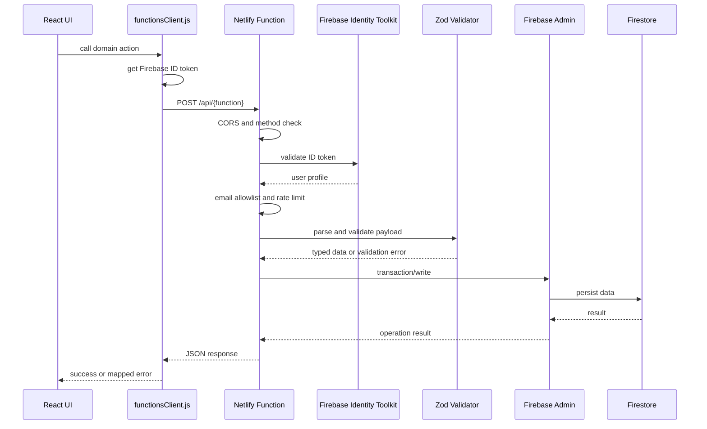
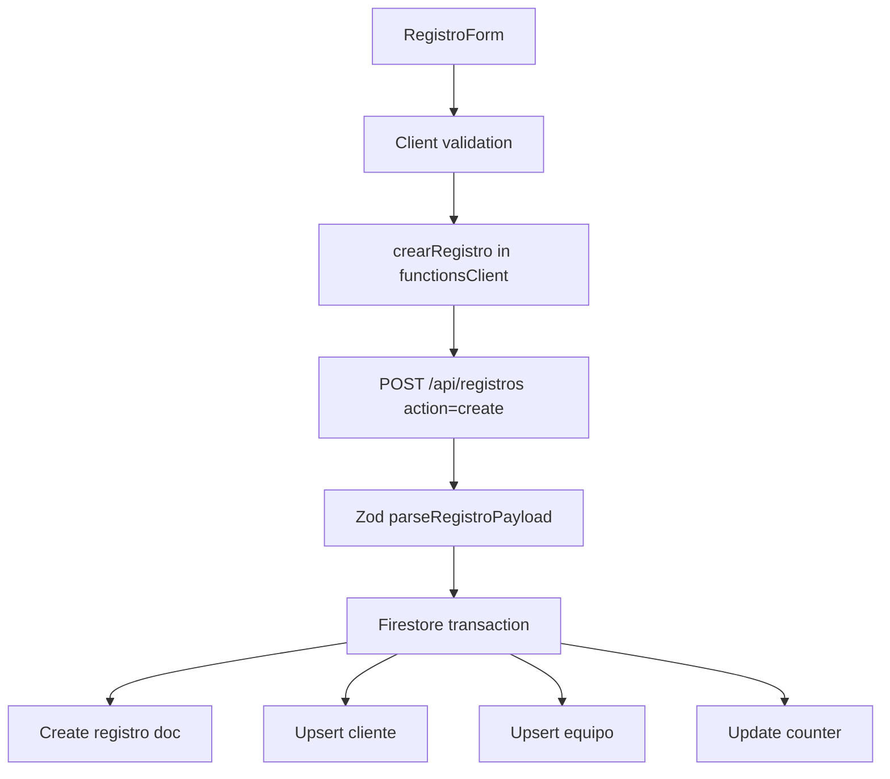
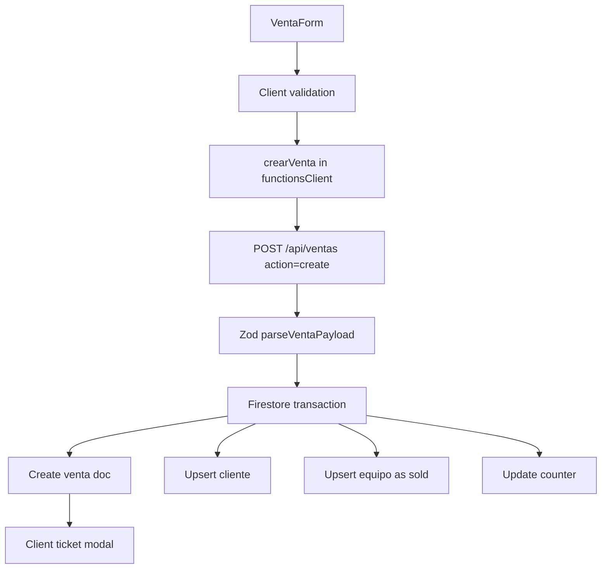
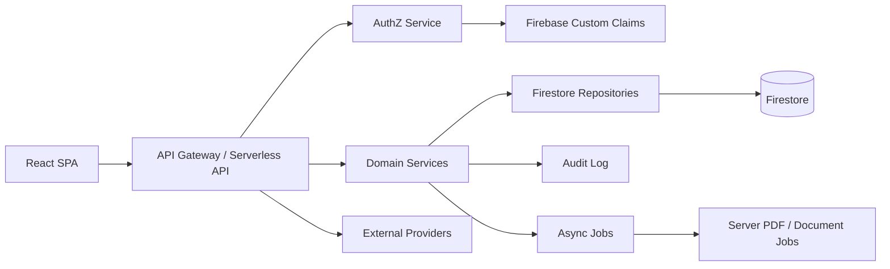

# Architecture

## Architecture Principles

The current implementation favors pragmatic delivery on the Firebase and Netlify stack. It is optimized for a private operational SaaS with a small trusted user group. The architecture separates privileged writes into serverless functions while keeping realtime reads in the browser through Firestore.

Enterprise architecture goals for the next stage:

- Keep business rules server-authoritative.
- Preserve least-privilege Firestore rules.
- Move aggregation and search away from client-only arrays.
- Add tenant isolation and role-based authorization.
- Make validations shared, tested and versioned.
- Make operational workflows auditable.

## Repository Structure

```text
.
+-- src/
|   +-- app/
|   |   +-- App.jsx
|   +-- components/
|   |   +-- branding/
|   |   +-- navigation/
|   |   +-- ui/
|   +-- config/
|   |   +-- auth.js
|   |   +-- branding.js
|   |   +-- legal.js
|   +-- features/
|   |   +-- auth/
|   |   +-- boletas/
|   |   +-- clientes/
|   |   +-- dashboard/
|   |   +-- legal/
|   |   +-- registros/
|   |   +-- settings/
|   |   +-- ventas/
|   +-- lib/
|   |   +-- firebase.js
|   +-- services/
|   |   +-- functionsClient.js
|   +-- utils/
|   +-- index.css
|   +-- main.jsx
+-- netlify/
|   +-- functions/
+-- scripts/
+-- public/
+-- docs/
+-- firestore.rules
+-- firestore.indexes.json
+-- netlify.toml
+-- firebase.json
+-- vite.config.js
+-- package.json
```

## Frontend Architecture

The app is a React SPA. `src/main.jsx` mounts the root application under React Strict Mode. `src/App.jsx` re-exports `src/app/App.jsx`, which is the main application shell.

The main app shell owns:

- Firebase auth session state.
- Current view state.
- Global search state.
- Top and mobile navigation.
- Firestore realtime subscriptions.
- Pagination state for registrations and sales.
- Toast notifications.
- Logo configuration read state.
- Lazy-loaded feature modules.

Feature modules implement business surfaces:

- `registros`: registration form/list/ticket/scanner.
- `ventas`: sales form/list/ticket.
- `clientes`: customer directory and customer edit modal.
- `boletas`: foreign receipt flow and PDF generation.
- `legal`: legal pages, cookie banner and consent gate.
- `auth`: login screen and legal consent recording.

## Backend Architecture

The canonical backend is Netlify Functions.

```text
netlify/functions
+-- _shared.mjs
+-- _validators.mjs
+-- _firebaseAdmin.mjs
+-- _clientesShared.mjs
+-- registros.mjs
+-- ventas.mjs
+-- clientes.mjs
+-- reniec.mjs
+-- analizarCajaGemini.mjs
+-- legalConsent.mjs
```

### Backend Request Pipeline



## Data Architecture

Firestore stores operational data under:

```text
artifacts/comunicate-pos/users/shared
```

Main collections:

- `clientes`
- `equipos`
- `registros`
- `ventas`
- `boletasExtranjeras`
- `legalConsents`
- `configuracion/logoVentas`
- `configuracion/contadorBoletas`

Global counters:

```text
_counters/registros
_counters/ventas
```

## Auth Architecture

Authentication flow:

1. User accepts legal documents in the login UI.
2. User authenticates with Google through Firebase Auth.
3. Frontend checks `EMAILS_PERMITIDOS`.
4. Server records legal consent using a Firebase ID token.
5. App listens to `onAuthStateChanged`.
6. Firestore rules and Netlify Functions independently enforce allowed email access.

Current allowlist locations:

- `src/config/auth.js`
- `netlify/functions/_shared.mjs`
- `firestore.rules`

Enterprise recommendation: replace repeated email lists with Firebase custom claims and centralized role management.

## Data Flow by Use Case

### Create Registration



### Create Sale



### Legal Consent

```mermaid
flowchart TD
  A[LegalConsentGate] --> B[local acceptance timestamp]
  B --> C[Google Sign-in]
  C --> D[POST /api/legalConsent]
  D --> E[Validate version and required slugs]
  E --> F[Write legalConsents/{uid_version}]
  F --> G[Write events subcollection]
```

## Architectural Inconsistencies

| Area | Current inconsistency | Impact |
|---|---|---|
| Backend naming | `backend/` exists but is empty; `functions/` exists as legacy/local env holder. | May confuse maintainers. |
| Auth allowlist | Duplicated in frontend, functions and Firestore rules. | Risk of drift. |
| Writes | Core writes use Netlify Functions, but logo and boletas write directly from client. | Mixed security model. |
| Data scope | All data under `users/shared`. | No tenant isolation. |
| Tests | `AGENTS.md` says `npm test`, but `package.json` has no `test` script. | CI/onboarding mismatch. |
| Legal | Peru/Tacna/domain baseline is configured, but formal registration, tax and provider contracts still need counsel confirmation. | Compliance hardening remains required before broad public use. |

## Non-Canonical Repository Paths

The active frontend/backend architecture is `src/` plus `netlify/functions/`. These paths should not be mistaken for active runtime surfaces:

| Path | Status | Guidance |
|---|---|---|
| `backend/` | Empty local placeholder. | Do not place new backend code here. Remove only in a cleanup-specific change. |
| `functions/` | Legacy Firebase Functions/local tooling area. Only `functions/.gitignore` is tracked. | Backend changes belong in `netlify/functions/`. Keep local secrets out of version control. |
| `deno.lock` | Netlify Edge/bootstrap lock artifact. | Keep unless a cleanup audit confirms it is unused by Netlify tooling. |
| `.agents/` | Agent/skill workflow assets. | Useful for development assistance, not part of production app runtime. |

## Recommended Enterprise Target Architecture



Target modules:

- `domain/registros`
- `domain/ventas`
- `domain/clientes`
- `domain/boletas`
- `domain/legal`
- `repositories/firestore`
- `services/authz`
- `services/audit`
- `services/external`
