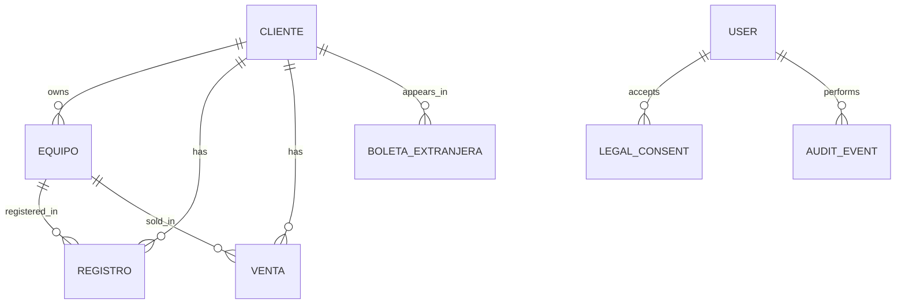

# Data Model

## Database Technology

The project uses Firestore. There are no Prisma models, SQL tables or migrations in the current implementation.

When this documentation refers to entities, collections or records, it means Firestore documents unless explicitly marked as future relational design.

## Root Application Scope

Current application ID:

```text
comunicate-pos
```

Current shared scope:

```text
artifacts/comunicate-pos/users/shared
```

This means all authorized users currently operate on the same data scope.

## Collection Overview

```text
artifacts/comunicate-pos/users/shared
+-- clientes/{dni}
+-- equipos/{imei}
+-- registros/{registroId}
+-- ventas/{ventaId}
+-- boletasExtranjeras/{boletaId}
+-- configuracion/logoVentas
+-- configuracion/contadorBoletas
+-- auditEvents/{eventId}
+-- legalConsents/{uid}_{documentVersion}
    +-- events/{eventId}

_counters
+-- registros
+-- ventas
```

## Entity Relationship Model



Firestore does not enforce these relations natively. The relationships are enforced through document IDs, duplicated fields and server transaction logic.

## clientes

Path:

```text
artifacts/{appId}/users/{scope}/clientes/{clienteId}
```

Document ID:

```text
cliente.dni
```

Purpose:

- Store customer identity and contact data.
- Preserve historical contact values through arrays.
- Link registrations and sales by `dniCliente`.

Fields:

| Field | Type | Description |
|---|---|---|
| `tipoDocumento` | string | `DNI`, `CE`, `PASAPORTE` or `RUC`. |
| `dni` | string | Document number; also document ID. |
| `nombre` | string | Customer full name. |
| `celular` | string | Primary phone. |
| `celularRef` | string | Reference phone. |
| `correo` | string | Primary email. |
| `direccion` | string | Customer address. |
| `celulares` | array | Historical phone list. |
| `correos` | array | Historical email list. |

## equipos

Path:

```text
artifacts/{appId}/users/{scope}/equipos/{equipoId}
```

Document ID:

```text
equipo.idEquipo
```

Purpose:

- Store device identity and ownership.
- Keep registration/sale flags.
- Provide data reuse for existing customer equipment.

Fields:

| Field | Type | Description |
|---|---|---|
| `idEquipo` | string | Primary IMEI. |
| `idDuenio` | string | Owner document number. |
| `imei2` | string | Secondary IMEI. |
| `sn` | string | Serial number. |
| `marca` | string | Device brand. |
| `modelo` | string | Technical model. |
| `nombreComercial` | string | Commercial product name. |
| `isRegistrado` | boolean | Registration flag. |
| `imei1Registrado` | boolean | IMEI 1 registration flag. |
| `imei2Registrado` | boolean | IMEI 2 registration flag. |
| `isVendido` | boolean | Sale flag. |
| `ram` | string | RAM value in GB. |
| `memoria` | string | Storage value in GB. |
| `color` | string | Device color. |

## registros

Path:

```text
artifacts/{appId}/users/{scope}/registros/{registroId}
```

Purpose:

- Store each device registration operation.
- Track carrier, registration status, type, price and date.

Fields:

| Field | Type | Description |
|---|---|---|
| `nRegistro` | string | Business sequence, e.g. `RECO-00001`. |
| `tipoDocumentoCliente` | string | Customer document type. |
| `dniCliente` | string | Customer document number. |
| `celularCliente` | string | Customer phone at time of registration. |
| `celularRef` | string | Reference phone. |
| `imeiEquipo` | string | Primary equipment IMEI. |
| `imeiRegistrado` | string | Exact IMEI registered. |
| `imei2Equipo` | string | Secondary IMEI if present. |
| `modeloEquipo` | string | Model. |
| `marcaEquipo` | string | Brand. |
| `nombreComercialEquipo` | string | Commercial name. |
| `estado` | string | `NO BLOQUEADO` or `BLOQUEADO`. |
| `operador` | string | `CLARO`, `MOVISTAR`, `ENTEL` or `BITEL`. |
| `tipo` | string | `TIENDA`, `EXTERNO` or `PASE`. |
| `precio` | string | Decimal money string. |
| `fecha` | string | ISO date string. |
| `pdfDniUrl` | string | Optional document PDF URL. |
| `pdfCajaUrl` | string | Optional box PDF URL. |
| `pdfReciboUrl` | string | Optional receipt PDF URL. |

## ventas

Path:

```text
artifacts/{appId}/users/{scope}/ventas/{ventaId}
```

Purpose:

- Store each equipment sale.
- Preserve equipment price, accessory items and total sale amount.

Fields:

| Field | Type | Description |
|---|---|---|
| `nVenta` | string | Business sequence, e.g. `VEN-0001`. |
| `tipoDocumentoCliente` | string | Customer document type. |
| `dniCliente` | string | Customer document number. |
| `imeiEquipo` | string | Sold equipment IMEI. |
| `imei2Equipo` | string | Secondary IMEI. |
| `sn` | string | Serial number. |
| `modeloEquipo` | string | Model. |
| `marcaEquipo` | string | Brand. |
| `nombreComercial` | string | Commercial name. |
| `ram` | string | RAM. |
| `memoria` | string | Storage. |
| `color` | string | Color. |
| `precio` | string | Total sale amount. |
| `precioEquipo` | string | Equipment-only amount. |
| `medioPago` | string | `EFECTIVO`, `TRANSFERENCIA` or `TARJETA`. |
| `itemsAdicionales` | array | Accessories with name, quantity and price. |
| `fecha` | string | ISO date string. |

Note: `firestore.rules` currently has `validVenta()` that does not include `precioEquipo` and `itemsAdicionales` for direct client writes. Main sale writes are server-side and bypass client rules through Admin SDK.

## boletasExtranjeras

Path:

```text
artifacts/{appId}/users/{scope}/boletasExtranjeras/{boletaId}
```

Purpose:

- Store foreign receipt history.
- Preserve receipt payload for reprinting.

Fields:

| Field | Type | Description |
|---|---|---|
| `nBoleta` | int | Receipt number. |
| `clienteDni` | string | Customer document. |
| `clienteNombre` | string | Customer name. |
| `totalPen` | number | Total in PEN. |
| `totalClp` | number | Total in CLP. |
| `fechaHora` | string | Issue date/time. |
| `formato` | int | Receipt format 1, 2 or 3. |
| `origen` | string | `ventas` or `manual`. |
| `boletaData` | map | Full receipt payload. |
| `createdAt` | timestamp | Server timestamp. |

## legalConsents

Path:

```text
artifacts/{appId}/users/{scope}/legalConsents/{uid}_{documentVersion}
```

Purpose:

- Record legal acceptance evidence for authenticated users.
- Store document version, required document snapshot and cookie preferences.

Fields:

| Field | Type | Description |
|---|---|---|
| `uid` | string | Firebase Auth user ID. |
| `email` | string | Authenticated user email. |
| `documentVersion` | string | Active legal version. |
| `acceptedAtClient` | string | Client-side timestamp. |
| `acceptedAt` | timestamp | Server timestamp. |
| `updatedAt` | timestamp | Server timestamp. |
| `documents` | array | Required document snapshot. |
| `cookiePreferences` | map | Essential, analytics, marketing flags. |
| `timezone` | string | Client timezone. |
| `locale` | string | Client locale. |
| `source` | string | Consent source. |
| `ipAddress` | string | Client IP from headers. |
| `userAgent` | string | Browser user agent. |

Subcollection:

```text
events/{eventId}
```

Each event stores the same payload plus `eventType` and `createdAt`.

## auditEvents

Path:

```text
artifacts/{appId}/users/{scope}/auditEvents/{eventId}
```

Purpose:

- Record critical server-side actions with a shared request correlation ID.
- Support production debugging and operational review from Netlify logs back to Firestore writes.

Fields:

| Field | Type | Description |
|---|---|---|
| `requestId` | string | Correlation ID also returned in the `X-Request-Id` header. |
| `functionName` | string | Netlify Function name. |
| `actorUid` | string | Authenticated Firebase user ID. |
| `actorEmail` | string | Authenticated user email. |
| `eventType` | string | Combined event name, e.g. `venta.create`. |
| `entityType` | string | `registro`, `venta`, `cliente` or `legalConsent`. |
| `entityId` | string | Affected document ID. |
| `action` | string | `create`, `update`, `delete`, `unlock` or `accept`. |
| `status` | string | Current status, usually `success`. |
| `metadata` | map | Limited operational metadata without tokens or large payloads. |
| `createdAt` | timestamp | Server timestamp. |
| `createdAtIso` | string | ISO timestamp fallback for log correlation. |

## configuracion/logoVentas

Path:

```text
artifacts/{appId}/users/{scope}/configuracion/logoVentas
```

Purpose:

- Store ticket logo as a data URL.

Field:

| Field | Type | Description |
|---|---|---|
| `dataUrl` | string | Base64 image data URL. |

Recommendation:

- Move binary image storage to Firebase Storage for enterprise scale.

## configuracion/contadorBoletas

Path:

```text
artifacts/{appId}/users/{scope}/configuracion/contadorBoletas
```

Purpose:

- Track foreign receipt sequence.

Fields:

| Field | Type | Description |
|---|---|---|
| `last` | int | Last emitted number. |
| `updatedAt` | timestamp | Server timestamp. |

## _counters

Paths:

```text
_counters/registros
_counters/ventas
```

Purpose:

- Store last business sequence for registrations and sales.

Fields:

| Field | Type | Description |
|---|---|---|
| `last` | number | Last numeric sequence. |
| `updatedAt` | string | ISO update timestamp. |

## Indexes

Current `firestore.indexes.json` defines field overrides for:

- `registros.fecha` ascending and descending.
- `ventas.fecha` ascending and descending.

There are no composite indexes currently declared.

## Data Integrity Rules

Implemented:

- Zod validates server-mediated writes.
- Firestore rules block direct client writes for `clientes`, `equipos`, `registros` and `ventas`.
- Firestore rules validate direct client writes for logo and foreign receipts.
- Server transactions update related customer/equipment records.

Important gaps:

- No tenant boundary.
- Some client views derive from paginated data and may be incomplete at high volume.
- External monitoring/alerting provider is not connected; current monitoring signal is structured JSON logs plus Firestore audit events.
