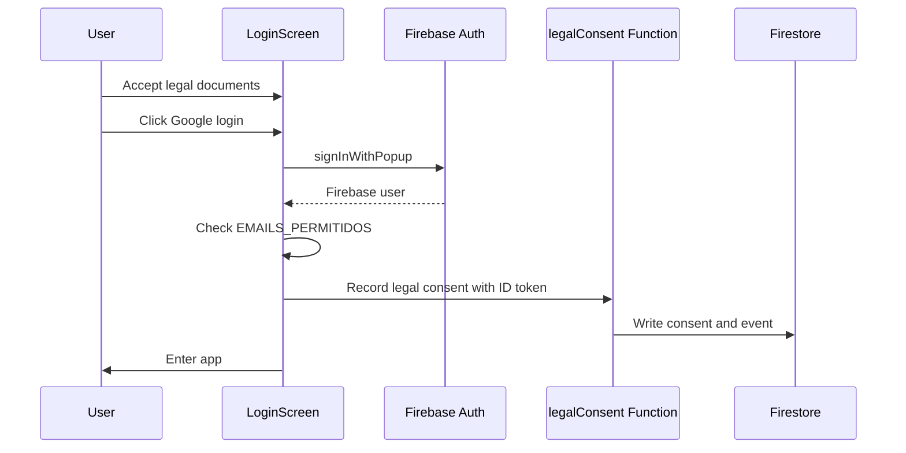

# Authentication and Security

## Security Model Summary

COMUNIC@TE uses Firebase Authentication for identity, Firestore rules for direct database access control and Netlify Functions for privileged server-side operations.

Current security posture:

- Stronger than a pure client-only Firestore app for core writes.
- Suitable for a small private operator group.
- Not yet enterprise-grade for multi-tenant, role-based or compliance-heavy deployments.

## Authentication

Authentication is implemented with:

- Firebase Auth.
- Google provider.
- `signInWithPopup`.
- `onAuthStateChanged`.
- Firebase ID tokens for API calls.

Login flow:



## Authorization

Authorization currently relies on email allowlists.

Allowlist sources:

| Location | Purpose |
|---|---|
| `src/config/auth.js` | Client-side login gate. |
| `netlify/functions/_shared.mjs` | API authorization. |
| `firestore.rules` | Firestore direct read/write authorization. |

Allowed user condition in Firestore:

- Auth exists.
- Email is verified.
- Email is in the hard-coded allowlist.

Current limitation:

- There are no implemented roles.
- There are no per-action permissions.
- There is no tenant isolation.

Recommended enterprise model:

- Firebase custom claims: `orgId`, `roles`, `permissions`.
- Firestore paths under `organizations/{orgId}` or `tenants/{tenantId}`.
- Server-side `requirePermission(user, action, resource)` checks.
- Centralized permission registry.

## Session Model

Firebase Auth manages browser session persistence. The frontend obtains fresh ID tokens when calling functions:

```js
const token = await auth.currentUser?.getIdToken();
```

Current server validation:

- Uses Identity Toolkit `accounts:lookup` endpoint.
- Checks verified email and allowlist.

Enterprise recommendation:

- Use Firebase Admin `auth().verifyIdToken(token, true)`.
- Check revoked tokens.
- Check disabled users.
- Validate custom claims.

## API Security

Implemented in `_shared.mjs`:

- Origin-aware CORS.
- `POST` method restriction.
- Bearer token requirement.
- JSON parsing with controlled error response.
- Per-user in-memory rate limiting.

Allowed origins include:

- Local development origins.
- Firebase Hosting domain.
- Netlify deploy URLs.
- `ALLOWED_ORIGINS` env values.

## Rate Limiting

Current rate limit storage:

```js
const rateLimits = new Map();
```

Limits:

| Endpoint | Limit |
|---|---|
| `reniec` | 60 requests per minute per UID |
| `gemini` | 15 requests per minute per UID |
| `registros` | 120 requests per minute per UID |
| `ventas` | 120 requests per minute per UID |
| `clientes` | 120 requests per minute per UID |
| `legalConsent` | 20 requests per minute per UID |

Limitations:

- In-memory only.
- Per Netlify instance.
- Resets on cold starts.
- Does not rate-limit unauthenticated token validation attempts by IP.

Enterprise recommendation:

- Use Redis/Upstash or Firestore TTL counters.
- Include IP, UID, endpoint and provider-cost tier.
- Add provider circuit breakers.

## Validation

Server validation uses Zod in `_validators.mjs`.

Validated domains:

- Document type and document number.
- Phone format.
- Email format.
- IMEI format and Luhn check.
- Money format.
- ISO date conversion.
- Required fields.
- Allowed enums for status, carrier, sale payment method and record type.
- Payload shape with `.strict()` for nested objects.

Client validation exists for UX only and should not be treated as authoritative.

## Firestore Rules

Core protections:

- `clientes`, `equipos`, `registros` and `ventas`: read allowed to authorized users, direct create/update/delete blocked.
- `configuracion/logoVentas`: direct read/write allowed for authorized users with data URL validation.
- `configuracion/contadorBoletas`: direct read/write allowed for authorized users with numeric counter validation.
- `boletasExtranjeras`: direct create allowed for authorized users with schema validation.
- Catch-all denies everything else.

## External API Security

### RENIEC Provider

Secret:

- `RENIEC_TOKEN`

Request:

- Server function sends `Authorization: Bearer <RENIEC_TOKEN>`.

Risks:

- PII is sent to an external provider.
- Timeout and circuit breaker are not currently implemented.

### Gemini OCR

Secret:

- `GEMINI_API_KEY`

Request:

- Server function sends image base64 to Gemini generateContent API.

Risks:

- Image may contain device identifiers and potentially personal or commercial information.
- Server-side payload size enforcement should be added.
- Timeout and provider cost controls should be added.

## Security Headers

Currently configured:

- `X-Content-Type-Options: nosniff`
- `Referrer-Policy: strict-origin-when-cross-origin`
- `Permissions-Policy: camera=(), microphone=(), geolocation=()`
- `X-Frame-Options: DENY`

Missing or recommended:

- Content Security Policy.
- Strict-Transport-Security.
- COOP/COEP/CORP where compatible.
- Cache policy for immutable assets.

Important note:

- `Permissions-Policy: camera=()` can conflict with camera scanning depending on browser and hosting behavior. The scanner requires camera access. Review this before production hardening.

## OWASP-Oriented Assessment

| Category | Current posture |
|---|---|
| Broken Access Control | Main risk. Email allowlist only, shared data scope, no roles. |
| Cryptographic Failures | Secrets kept in env; no custom encryption for Firestore fields. |
| Injection | Low SQL risk because no SQL. JSON payloads validated server-side. CSP missing. |
| Insecure Design | Server-side writes exist, but business invariants such as IMEI uniqueness need stronger enforcement. |
| Security Misconfiguration | Headers incomplete; duplicated allowlist; legal production details still need formal confirmation. |
| Vulnerable Components | `npm audit` reports low severity transitives. |
| Identification/Auth Failures | Auth exists; token revocation checks should be improved. |
| Software/Data Integrity | No CI/test suite. |
| Logging/Monitoring | No structured production monitoring. |
| SSRF | External URLs are fixed constants, low SSRF risk. |

## Security Roadmap

Priority order:

1. Add tenant and role model.
2. Move authorization to custom claims and server checks.
3. Enforce IMEI uniqueness server-side.
4. Implement distributed rate limiting.
5. Add CSP and HSTS.
6. Add structured audit logs.
7. Add tests for security-critical validation and transactions.
8. Review legal/provider data processing agreements.
