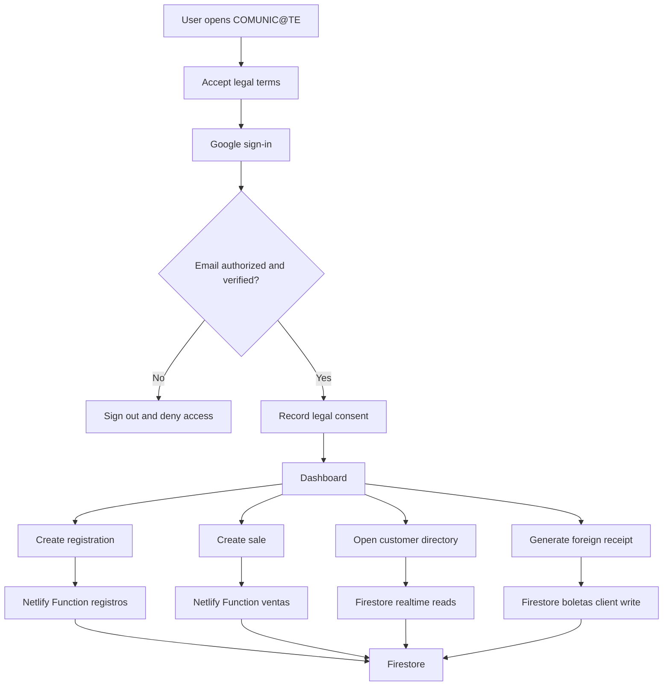
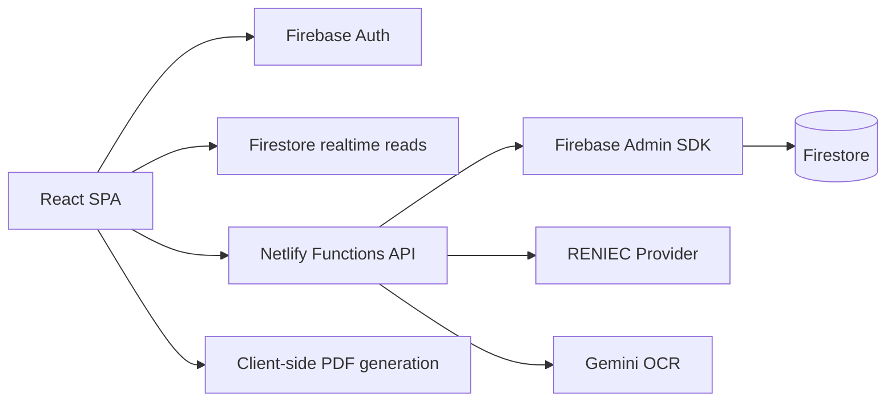

# System Overview

## Executive Summary

COMUNIC@TE is an internal operations SaaS for managing mobile device registration, device sales, customer information, thermal-ticket PDF generation, foreign receipt generation and legal consent capture. The platform is designed for a business workflow where authorized operators need fast access to customer identity data, equipment identifiers such as IMEI and serial number, payment details and document/ticket outputs.

The system is implemented as a single-page React application with Firebase Authentication, Firestore as the operational database and Netlify Functions as the canonical backend for sensitive writes and external API integration.

## Product Objective

The platform centralizes operational workflows that would otherwise live across spreadsheets, manual tickets, messaging apps and disconnected customer records.

Primary goals:

- Register equipment with IMEI, customer, carrier, status and price.
- Record equipment sales and generate thermal PDF tickets.
- Maintain customer and equipment history.
- Query RENIEC data for DNI-based customer assistance.
- Scan phone boxes with Gemini OCR to reduce manual data entry.
- Generate foreign receipt formats for Chile-oriented workflows.
- Capture legal acceptance and cookie preferences.
- Keep privileged writes behind authenticated server functions.

## Problem Solved

COMUNIC@TE reduces operational friction in environments where staff must repeatedly capture device data, validate customer identity, generate receipts and keep a searchable history. It provides:

- Faster entry of IMEI/customer data.
- Fewer manual transcription errors through OCR and validation.
- Consolidated customer history across sales and registrations.
- Consistent PDF/ticket generation.
- Firestore-backed realtime visibility.
- A single controlled login surface for authorized users.

## Current System Type

| Attribute | Current State |
|---|---|
| Product type | Private operational SaaS / internal business platform |
| Frontend style | Single-page application |
| Backend style | Serverless functions |
| Database style | Firestore document database |
| Auth model | Google login plus email allowlist |
| Tenant model | Shared operational scope, no true multitenancy currently |
| Deployment target | Netlify for app/functions, Firestore rules deployed separately |

## Core Modules

| Module | Path | Purpose |
|---|---|---|
| Dashboard | `src/features/dashboard/Dashboard.jsx` | Entry screen with totals and operational shortcuts. |
| Auth/Login | `src/features/auth/LoginScreen.jsx` | Google login, legal acceptance gate and brand entry surface. |
| Registros | `src/features/registros/` | Equipment registration creation, editing, listing, unlock and ticket output. |
| Ventas | `src/features/ventas/` | Equipment sales creation, editing, listing and ticket output. |
| Clientes | `src/features/clientes/ClientesList.jsx` | Customer directory, history, editing and deletion. |
| Boleta extranjera | `src/features/boletas/` | Chile-oriented receipt generation and history. |
| Legal | `src/features/legal/` | Legal documents, cookie consent and consent gate. |
| Branding | `src/components/branding/` and `src/config/branding.js` | Corporate hierarchy and UI brand attribution. |
| Settings | `src/features/settings/ConfiguracionLogo.jsx` | Ticket logo management. |
| API client | `src/services/functionsClient.js` | Authenticated frontend client for Netlify Functions. |
| Netlify Functions | `netlify/functions/` | Authenticated server-side actions and external API integration. |

## Technology Stack

| Layer | Technology | Role |
|---|---|---|
| UI runtime | React 19 | Component rendering and state. |
| Build tool | Vite 7 | Development server, bundling and build output. |
| Styling | Tailwind CSS 3 plus custom CSS utilities | Product UI layout, tokens and components. |
| Icons | lucide-react | Interface iconography. |
| Auth | Firebase Auth | Google sign-in and ID tokens. |
| Database | Firestore | Realtime operational persistence. |
| Backend | Netlify Functions | Server-side validation, writes and external APIs. |
| Validation | Zod | Server-side schema validation. |
| Admin SDK | firebase-admin | Server-side Firestore writes. |
| PDF | jsPDF, JsBarcode, local PDF417 script | Tickets and receipt generation. |
| External OCR | Gemini API | Phone box extraction. |
| External DNI | RENIEC provider via Codart API | DNI lookup. |

## Main User Flow

## High-Level Architecture

## Current Operational Boundaries

- Registrations, sales, customers and legal consent writes are mediated by Netlify Functions.
- Logo and foreign receipt writes currently happen directly from the client under Firestore rules.
- Reads for main collections happen directly from the client using Firestore SDK.
- Authorization is based on a fixed email allowlist in frontend, Netlify Functions and Firestore rules.
- Firestore data is currently stored in a shared scope: `artifacts/comunicate-pos/users/shared`.

## Known Enterprise Gaps

These are important for investors, architects and auditors:

- No true multitenancy or organization isolation.
- No formal RBAC or permission matrix.
- No automated test suite currently configured.
- No CI/CD workflow files in the repository.
- No Docker runtime.
- No relational schema or Prisma models.
- Legal documents define the current Peru/Tacna/domain baseline and still require formal legal review for company registration, tax data, provider contracts and retention schedules.
- Some operational views derive from paginated client data and may be incomplete at scale.
